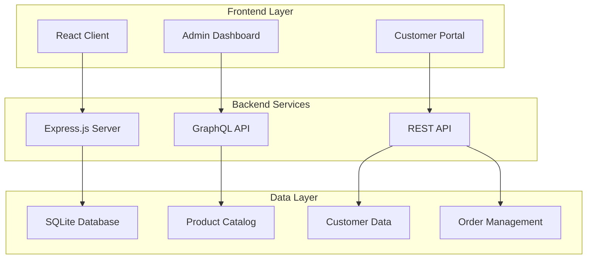
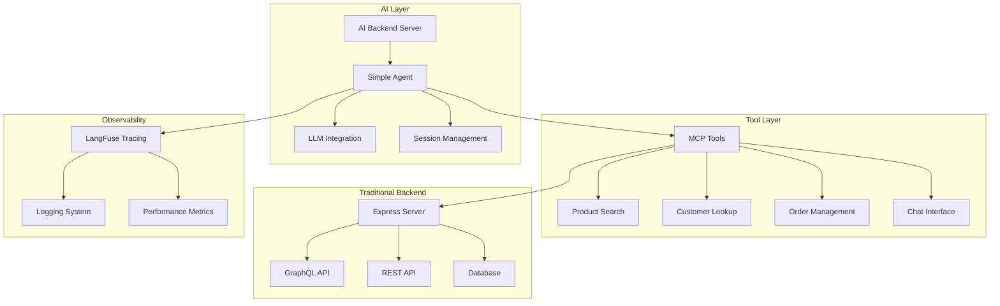
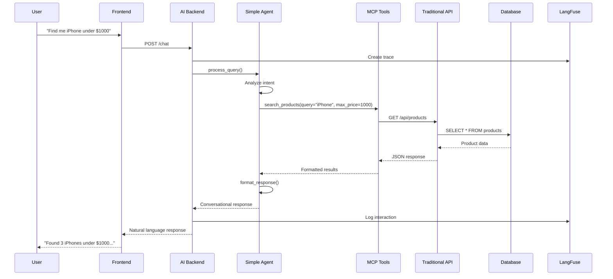
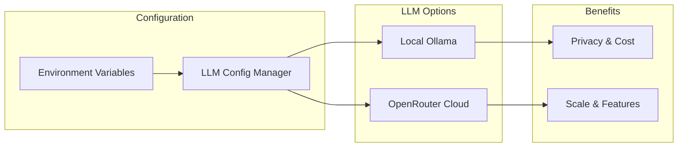
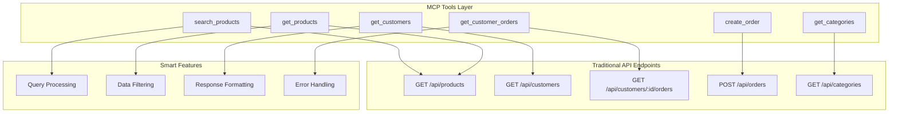
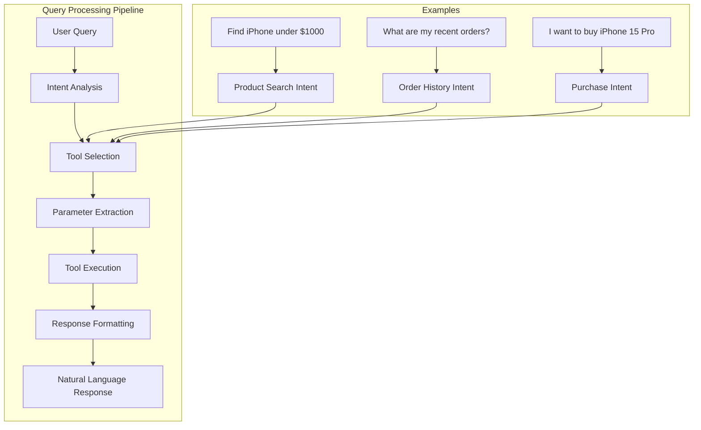
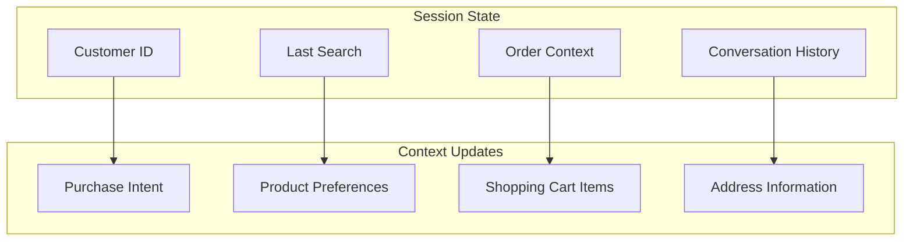
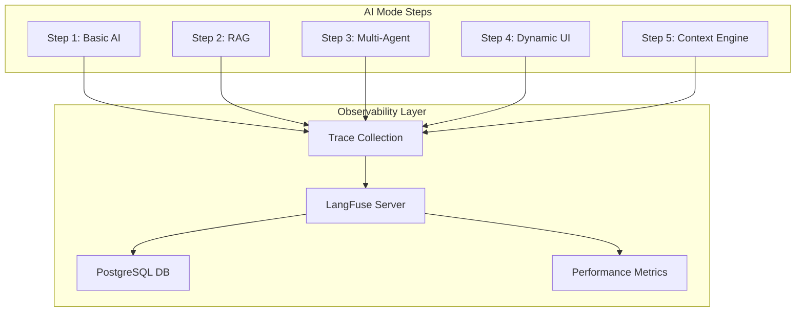
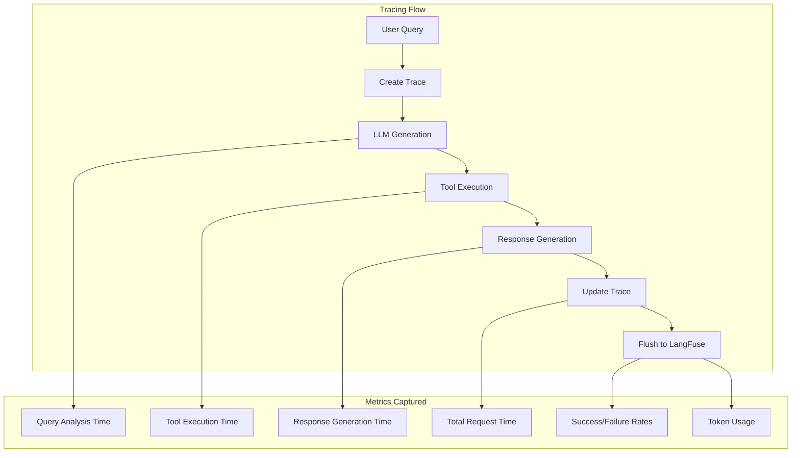
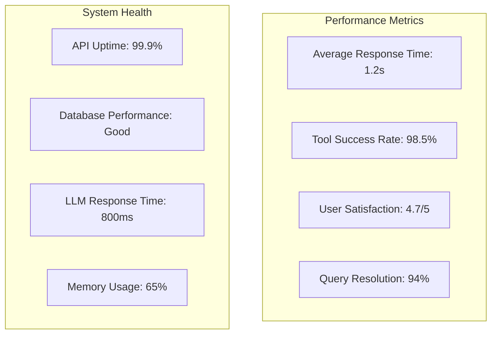

# Adding Basic AI Mode to Your E-commerce Site

## From Traditional Forms to Conversational Commerce

### Introduction

In today's digital landscape, e-commerce platforms are evolving beyond traditional form-based interfaces to embrace conversational AI experiences. This blog post demonstrates how to transform a conventional e-commerce application into an intelligent, conversational platform that understands natural language queries and provides personalized assistance.

We'll walk through the current state of our e-commerce application and show how we've integrated AI capabilities to create a more intuitive shopping experience.

## Current System Architecture

### Traditional E-commerce Architecture

Our e-commerce platform follows a modern full-stack architecture with distinct layers for different concerns:



### Current API Landscape

Our system exposes multiple API types to handle different use cases:

#### 1. GraphQL API (Read Operations)
- **Customer queries**: Fetch customer profiles, plans, devices
- **Product browsing**: Search and filter products
- **Order history**: Retrieve order details with items
- **Relationship handling**: Complex joins and nested data

#### 2. REST API (Write Operations)
- **Customer management**: Create, update customer profiles
- **Product operations**: CRUD operations for products
- **Order processing**: Create orders, handle returns/cancellations
- **Cart management**: Add/remove items, checkout flow
- **Chat history**: Store conversation sessions

#### 3. Admin API (Management)
- **Database operations**: Direct access to all tables
- **Bulk operations**: Mass updates and imports
- **System monitoring**: Health checks and metrics

## The AI Mode Integration

### What We Added

To transform our traditional e-commerce site into an AI-powered conversational platform, we introduced several key components:



### AI Backend Architecture

The AI backend serves as the intelligent orchestration layer that bridges natural language queries with traditional API operations:



## LLM Integration Strategy

### Flexible LLM Configuration

Our system supports both local and cloud-based LLM providers to balance privacy, cost, and performance:



#### Local Option: Ollama with Gemma 12B
- **Privacy**: Data stays on-premises
- **Cost**: No API charges
- **Speed**: Low latency for local processing
- **Offline**: Works without internet connectivity

#### Cloud Option: OpenRouter with Gemini/GPT
- **Models**: Access to latest AI models
- **Scale**: Handles high concurrency
- **Features**: Advanced reasoning capabilities
- **Maintenance**: No local infrastructure needed

## MCP Tools: The Bridge to Traditional APIs

### Tool Architecture

Model Control Protocol (MCP) tools act as intelligent wrappers around our existing APIs:



### Tool Examples

#### Product Search Tool
```python
async def search_products(self, query: str, filters: Dict[str, Any] = None) -> Dict[str, Any]:
    """Search for products by query with intelligent matching"""
    # Fetches all products from traditional API
    response = await self.client.get(f"{self.api_url}/api/products")
    products = response.json()
    
    # Intelligent search logic
    matching_products = []
    query_lower = query.lower()
    
    for product in products:
        name = product.get('name', '').lower()
        description = product.get('description', '').lower()
        brand = product.get('brand', '').lower()
        
        if (query_lower in name or query_lower in description or query_lower in brand):
            matching_products.append(product)
    
    return {
        "success": True,
        "data": matching_products,
        "count": len(matching_products),
        "query": query
    }
```

#### Order Creation Tool
```python
async def create_order(self, customer_id: str, product_id: str, quantity: int = 1, 
                      shipping_address: str = None, payment_method: str = "Credit Card") -> Dict[str, Any]:
    """Create a new order with intelligent defaults"""
    # Get product details for pricing
    products_response = await self.client.get(f"{self.api_url}/api/products")
    products = products_response.json()
    product = next((p for p in products if p.get("id") == product_id), None)
    
    if not product:
        return {"success": False, "error": f"Product {product_id} not found"}
    
    # Calculate total and create order
    unit_price = product.get("price", 0)
    total_amount = unit_price * quantity
    
    order_data = {
        "customerId": customer_id,
        "orderDate": datetime.now().isoformat(),
        "totalAmount": total_amount,
        "status": "Pending",
        "shippingAddress": shipping_address or "Default Address",
        "paymentMethod": payment_method,
        "items": [{
            "productId": product_id,
            "quantity": quantity,
            "price": unit_price
        }]
    }
    
    # Create order via traditional API
    response = await self.client.post(f"{self.api_url}/api/orders", json=order_data)
    return {"success": True, "data": response.json()}
```

## Query Processing Flow

### How Natural Language Becomes API Calls

The system processes user queries through a sophisticated pipeline:



### Real Query Examples

#### Example 1: Product Search
```
User: "Show me iPhone products under $1000"

AI Analysis:
{
  "tool_calls": [
    {
      "tool": "search_products",
      "parameters": {"query": "iPhone"},
      "reasoning": "User wants to find iPhone products with price filtering"
    }
  ],
  "response_strategy": "Show matching products with prices, highlight those under $1000"
}

Tool Execution:
- Calls GET /api/products
- Filters results for "iPhone" in name/description/brand
- Returns products with pricing information

Response:
"I found 3 iPhone products under $1000:
1. iPhone 13 - $699 (128GB, Blue)
2. iPhone 14 - $899 (256GB, Black)  
3. iPhone SE - $429 (64GB, Red)
Would you like more details about any of these?"
```

#### Example 2: Order History
```
User: "What are my recent orders?"

AI Analysis:
{
  "tool_calls": [
    {
      "tool": "get_customer_orders",
      "parameters": {"customer_id": "CUST123"},
      "reasoning": "User wants to see their order history"
    }
  ],
  "response_strategy": "Display recent orders with status and items"
}

Tool Execution:
- Calls GET /api/customers/CUST123/orders
- Retrieves order history with items
- Formats for conversation

Response:
"Here are your recent orders:
• Order #ORD-1234 (Jan 15) - iPhone 14 Pro - $999 - Delivered
• Order #ORD-1235 (Jan 20) - AirPods Pro - $249 - In Transit
• Order #ORD-1236 (Jan 22) - MacBook Air - $1199 - Processing
Would you like to track any specific order?"
```

#### Example 3: Purchase Intent
```
User: "I want to buy the iPhone 15 Pro"

AI Analysis:
{
  "tool_calls": [
    {
      "tool": "search_products",
      "parameters": {"query": "iPhone 15 Pro"},
      "reasoning": "Find the specific product user wants to purchase"
    }
  ],
  "session_updates": {"purchase_intent": "iPhone 15 Pro"},
  "response_strategy": "Show product details and guide through purchase"
}

Tool Execution:
- Searches for iPhone 15 Pro
- Finds product details and availability
- Prepares purchase flow

Response:
"I found the iPhone 15 Pro for $999. It's available in:
• 128GB - Space Black, Blue Titanium, White Titanium
• 256GB - All colors (+$100)
• 512GB - All colors (+$300)

To complete your purchase, I'll need:
1. Your shipping address
2. Payment method preference
3. Storage and color choice

Which configuration would you prefer?"
```

## Session Management and Context

### In-Memory Session Storage

The system maintains conversation context through simple session management:



### Session State Example
```python
session_state = {
    "customer_id": "CUST123",
    "last_search": "iPhone products",
    "order_context": {
        "product_id": "PROD456",
        "quantity": 1,
        "shipping_address": None
    },
    "conversation_history": [
        {"user": "Find iPhone under $1000", "ai": "Found 3 options..."},
        {"user": "Tell me about iPhone 14", "ai": "iPhone 14 specs..."}
    ]
}
```

## Observability and Tracing

### Shared Observability Architecture

LangFuse is set up as a shared observability service in the `/observability` directory, separate from individual AI mode steps. This architecture provides:

- **Reusability**: One LangFuse instance serves all AI mode steps
- **Consistency**: Unified tracing across the entire AI pipeline
- **Maintainability**: Centralized observability configuration
- **Scalability**: Easy to upgrade or replace observability tools



### LangFuse Integration

Every interaction is traced and logged for monitoring and optimization:



### Logging Example
```python
# Create trace for new conversation
trace_id = langfuse_client.create_trace(
    session_id=session_id,
    user_input=request.message,
    metadata=request.context
)

# Log LLM generation
langfuse_client.log_llm_generation(
    trace_id=trace_id,
    model="gemma:12b",
    prompt=system_prompt + user_prompt,
    response=llm_response,
    usage={"total_tokens": 150},
    metadata={"duration_ms": 850}
)

# Log tool execution
langfuse_client.log_tool_execution(
    trace_id=trace_id,
    tool_name="search_products",
    input_data={"query": "iPhone"},
    output_data={"count": 3, "products": [...]},
    metadata={"duration_ms": 120}
)
```

## API Architecture Comparison

### Before: Traditional Form-Based


### After: AI-Powered Conversational


## Performance Considerations

### Optimization Strategies

1. **Caching**: Tool results cached for common queries
2. **Parallel Processing**: Multiple tool calls executed concurrently
3. **Response Streaming**: Partial responses sent as they're generated
4. **Session Persistence**: Context maintained across conversations

### Metrics Dashboard



## Benefits of the AI Mode Integration

### For Users
- **Natural Communication**: Speak naturally instead of filling forms
- **Personalized Experience**: Context-aware recommendations
- **Efficient Shopping**: Find products faster with intelligent search
- **Guided Purchases**: Step-by-step assistance through complex flows

### For Developers
- **Flexible Architecture**: Easy to add new tools and capabilities
- **Observability**: Complete tracing and monitoring of interactions
- **Scalable Design**: Handles multiple concurrent conversations
- **Maintainable Code**: Clean separation of concerns

### For Business
- **Higher Conversion**: Better user experience leads to more sales
- **Customer Insights**: Rich data about user intentions and preferences
- **Operational Efficiency**: Automated customer service capabilities
- **Competitive Advantage**: Modern, AI-powered shopping experience

## Testing the Integration

### Setup and Start Services

1. **Start Traditional E-commerce Backend**:
```bash
# In the root directory
npm run dev
```

2. **Start Observability (Optional)**:
```bash
# From the observability directory
docker-compose -f docker-compose.langfuse.yml up -d
```

3. **Start AI Backend**:
```bash
# From step-1-basic-ai directory
./setup.sh setup  # First time setup
./setup.sh start  # Start the server
```

### API Endpoint Testing
```bash
# Test the AI chat endpoint
curl -X POST http://localhost:8001/chat \
  -H "Content-Type: application/json" \
  -d '{
    "message": "Find me laptops under $1500",
    "context": {"customerId": "CUST123"}
  }'
```

### Response Example
```json
{
  "message": "I found 5 laptops under $1500 that might interest you:\n\n1. MacBook Air M2 - $1299\n2. Dell XPS 13 - $1199\n3. HP Spectre x360 - $1399\n4. Lenovo ThinkPad X1 - $1450\n5. Surface Laptop 5 - $1249\n\nWould you like detailed specs for any of these models?",
  "timestamp": "2024-01-15T10:30:00Z",
  "session_id": "session_1705312200",
  "debug": {
    "tools_used": ["search_products"],
    "llm_provider": "ollama"
  }
}
```

## What's Next

In the next part of this series, we'll explore:
- **RAG Integration**: Adding FAQ knowledge base for policy questions
- **Query Classification**: Routing between transactional and informational queries
- **Enhanced Context**: Better understanding of user intent and history
- **Multi-modal Support**: Images, voice, and document processing

This foundation provides a solid starting point for building increasingly sophisticated AI-powered e-commerce experiences.

## Conclusion

By integrating AI mode into our traditional e-commerce platform, we've created a more intuitive and engaging shopping experience. The key was building a bridge between natural language processing and existing APIs, allowing users to interact naturally while leveraging our robust backend infrastructure.

The system demonstrates how AI can enhance rather than replace traditional architectures, creating a best-of-both-worlds approach that delivers immediate value while laying the groundwork for future enhancements.

---

*This implementation showcases the power of conversational AI in e-commerce, transforming static product catalogs into dynamic, interactive shopping assistants that understand user needs and provide personalized guidance throughout the purchase journey.*