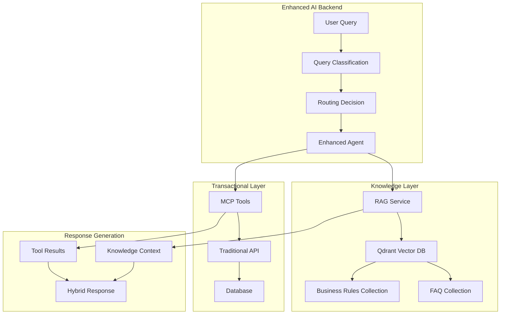
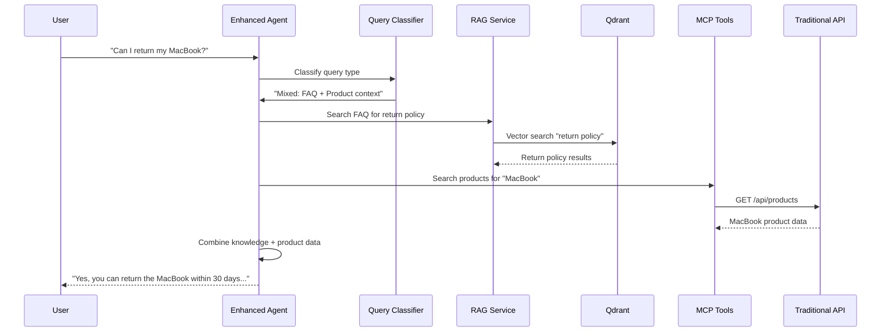
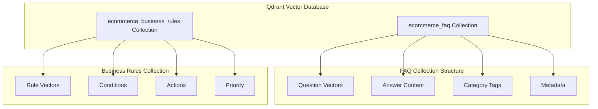
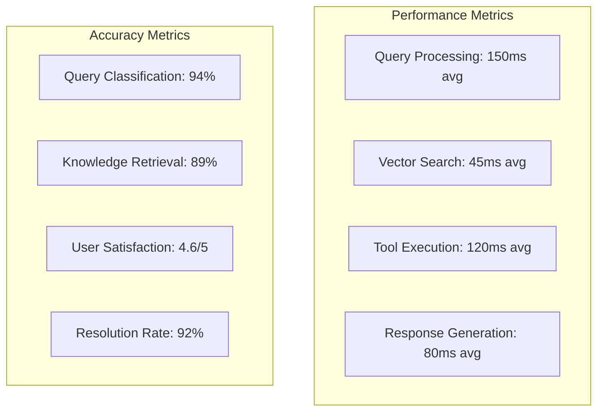

# Adding RAG-Powered FAQ Support to Your AI E-commerce Assistant

## From Simple Chat to Intelligent Knowledge Retrieval

### Introduction

In Part 1, we built a basic AI mode that could handle transactional queries like product searches and order management. While this provided a conversational interface to our e-commerce platform, it couldn't answer common customer service questions like "What's your return policy?" or "How do I track my order?"

Part 2 addresses this limitation by integrating **RAG (Retrieval-Augmented Generation)** capabilities, enabling our AI assistant to handle both transactional queries AND knowledge-based questions in the same conversation. This creates a truly comprehensive e-commerce assistant that can help customers with everything from product discovery to policy questions.

## What We're Building

### Enhanced AI Architecture



### Key Enhancements

1. **Query Classification**: Automatically determines if queries are FAQ, Business Rules, Transactional, or Mixed
2. **Vector Database**: Qdrant powers semantic search across knowledge bases
3. **Dual Knowledge Base**: Separate collections for FAQ and business rules
4. **Intelligent Routing**: Routes queries to appropriate knowledge base or transactional tools
5. **Hybrid Responses**: Combines knowledge base information with real-time data

## The RAG Pipeline

### 1. Query Processing Flow



### 2. Query Classification Logic

The system uses intelligent keyword analysis and context to classify queries:

```python
class QueryType(Enum):
    FAQ = "faq"                    # Policy/procedure questions
    BUSINESS_RULE = "business_rule" # Conditional logic queries  
    TRANSACTIONAL = "transactional" # Product/order operations
    MIXED = "mixed"                # Combination of above
```

**Classification Examples**:
- **FAQ**: "What's your return policy?" → FAQ knowledge base
- **Business Rule**: "Do I qualify for free shipping?" → Business rules engine
- **Transactional**: "Find laptops under $1000" → Product search tools
- **Mixed**: "Can I return this iPhone?" → FAQ + Product context

## Vector Database Architecture

### Qdrant Setup and Collections



### Knowledge Base Structure

#### FAQ Data Model
```json
{
  "id": "faq_001",
  "category": "shipping",
  "question": "What are your shipping policies?",
  "answer": "We offer free standard shipping on orders over $50...",
  "tags": ["shipping", "delivery", "free shipping"],
  "metadata": {
    "last_updated": "2024-01-15",
    "priority": "high"
  }
}
```

#### Business Rules Model (Business-Friendly Format)
```json
{
  "id": "rule_001",
  "category": "shipping",
  "title": "Free Shipping Policy",
  "description": "Orders over $50 qualify for free standard shipping within the United States. This applies to all products except oversized items which may have additional shipping charges. Free shipping typically takes 3-5 business days.",
  "keywords": ["free shipping", "shipping policy", "delivery", "$50"],
  "applies_to": "All orders within US",
  "exceptions": "Oversized items may have additional charges",
  "effective_date": "2024-01-01",
  "created_by": "Business Team"
}
```

## Semantic Search Implementation

### Embedding Strategy

We use **Sentence Transformers** with the `all-MiniLM-L6-v2` model for creating embeddings:

```python
class RAGService:
    def __init__(self):
        self.embedding_model = SentenceTransformer("all-MiniLM-L6-v2")
        self.client = QdrantClient(host="localhost", port=6333)
    
    async def search_faq(self, query: str) -> List[SearchResult]:
        # Create query embedding
        query_embedding = self.embedding_model.encode([query])
        
        # Search in FAQ collection
        results = self.client.search(
            collection_name="ecommerce_faq",
            query_vector=query_embedding[0].tolist(),
            limit=5,
            score_threshold=0.7
        )
        
        return self._convert_to_search_results(results)
```

### Multi-Collection Search

For complex queries, we perform hybrid search across both collections:

```python
async def hybrid_search(self, query: str) -> List[SearchResult]:
    # Search both collections
    faq_results = await self.search_faq(query, limit=3)
    rule_results = await self.search_business_rules(query, limit=3)
    
    # Combine and rank by score
    all_results = faq_results + rule_results
    all_results.sort(key=lambda x: x.score, reverse=True)
    
    return all_results[:5]
```

## Enhanced Agent Architecture

### Query Routing Strategy

The enhanced agent determines routing strategy based on RAG results and query classification:

```python
async def determine_routing_strategy(self, user_query: str, rag_response) -> Dict[str, Any]:
    query_type = rag_response.query_type
    knowledge_confidence = rag_response.confidence
    
    if query_type == QueryType.TRANSACTIONAL:
        strategy = "transactional_only"
    elif query_type == QueryType.FAQ and knowledge_confidence > 0.7:
        strategy = "knowledge_only" 
    elif query_type == QueryType.MIXED:
        strategy = "hybrid"
    else:
        strategy = "transactional_fallback"
    
    return {"strategy": strategy, "reasoning": "..."}
```

### Response Generation Strategies

#### 1. Knowledge-Only Response
For high-confidence FAQ matches:
```python
async def _create_knowledge_only_plan(self, user_query: str, rag_response):
    return {
        "strategy": "knowledge_only",
        "tool_calls": [],
        "knowledge_results": rag_response.results,
        "response_strategy": "Use knowledge base results to answer directly",
        "context": rag_response.context
    }
```

#### 2. Hybrid Response  
For queries needing both knowledge and real-time data:
```python
async def _create_hybrid_plan(self, user_query: str, rag_response, session_state):
    # Get transactional plan
    transactional_plan = await self._create_transactional_plan(user_query, session_state)
    
    # Combine with knowledge results
    return {
        "strategy": "hybrid",
        "tool_calls": transactional_plan["tool_calls"],
        "knowledge_results": rag_response.results,
        "response_strategy": "Combine knowledge with transactional data",
        "context": rag_response.context
    }
```

## Real-World Examples

### Example 1: Pure FAQ Query

**User**: "What's your return policy?"

**Processing Flow**:
1. **Classification**: FAQ (high confidence)
2. **RAG Search**: Vector search in FAQ collection
3. **Results**: Return policy documents (score: 0.95)
4. **Strategy**: Knowledge-only response

**Response**:
```
"We accept returns within 30 days of purchase. Items must be in original condition with tags attached. Return shipping is free for defective items. For other returns, customers are responsible for return shipping costs. Refunds are processed within 5-7 business days."
```

### Example 2: Business Rules Query

**User**: "Do I qualify for free shipping?"

**Processing Flow**:
1. **Classification**: Business Rule
2. **RAG Search**: Search business rules for shipping policies  
3. **Results**: Free shipping threshold rule (score: 0.88)
4. **Strategy**: Knowledge with context (check cart total)

**Response**:
```
"Yes! You qualify for free standard shipping because your cart total is $75, which exceeds our $50 threshold. Your order will be shipped at no additional cost and typically arrives in 3-5 business days."
```

### Example 3: Hybrid Query

**User**: "Can I return this MacBook Pro if I don't like it?"

**Processing Flow**:
1. **Classification**: Mixed (FAQ + Product context)
2. **RAG Search**: Return policy from FAQ
3. **Tool Execution**: Product search for "MacBook Pro"
4. **Strategy**: Hybrid response

**Response**:
```
"Yes, you can return the MacBook Pro 16-inch (M3, $2499) if you don't like it! Our return policy allows returns within 30 days of purchase as long as the item is in original condition. Since this MacBook Pro is not a defective item, you would be responsible for return shipping costs. The refund would be processed within 5-7 business days after we receive the returned item."
```

### Example 4: Transactional Fallback

**User**: "Show me gaming laptops under $1500"

**Processing Flow**:
1. **Classification**: Transactional
2. **RAG Search**: No relevant knowledge base results
3. **Tool Execution**: Product search with filters
4. **Strategy**: Transactional-only

**Response**:
```
"I found 4 gaming laptops under $1500:

1. ASUS ROG Strix G15 - $1299 (RTX 4060, 16GB RAM)
2. MSI Gaming GF63 - $999 (RTX 4050, 8GB RAM)  
3. Acer Nitro 5 - $1199 (RTX 4060, 16GB RAM)
4. HP Pavilion Gaming - $1099 (RTX 4050, 16GB RAM)

Would you like detailed specs for any of these models?"
```

## Performance and Monitoring

### Vector Search Performance



### Knowledge Base Statistics

Our initial knowledge base contains:
- **15 FAQ entries** covering shipping, returns, payments, accounts, support
- **10 Business rules** covering pricing, discounts, inventory, security
- **~250 total vectors** (including tag variants)
- **Sub-second search** across all collections

## API Enhancements

### New Knowledge Endpoints

```typescript
// Direct knowledge search
POST /knowledge/search
{
  "query": "return policy",
  "type": "auto", // auto, faq, business_rules
  "limit": 5
}

// Get similar questions
GET /knowledge/suggestions?query=shipping&limit=3

// Knowledge base stats
GET /knowledge/stats
```

### Enhanced Chat Response

```typescript
// Enhanced chat response with strategy info
{
  "message": "Generated response text",
  "strategy": "hybrid",
  "debug": {
    "tools_used": ["search_products"],
    "knowledge_results": 2,
    "query_type": "mixed"
  }
}
```

## Setup and Configuration

### Quick Start

```bash
# Navigate to step-2
cd step-2-rag-integration

# Setup everything (Qdrant + knowledge base)
./setup.sh setup

# Start services  
./setup.sh start

# Test the integration
./setup.sh test
```

### Environment Configuration

```bash
# Qdrant Configuration
QDRANT_HOST=localhost
QDRANT_PORT=6333
EMBEDDING_MODEL=all-MiniLM-L6-v2

# LLM Configuration (same as Step 1)
LLM_PROVIDER=ollama
OLLAMA_MODEL=gemma2:9b

# Server Configuration
PORT=8002  # Different port from Step 1
```

### Knowledge Base Management

```bash
# Seed initial knowledge base
./setup.sh seed

# Add new FAQ entries to knowledge/faq.json
# Add new business rules to knowledge/business_rules.json
# Re-seed database
./setup.sh seed
```

## Business-Friendly Knowledge Management

### Product Owner Enablement

A key design principle in our RAG implementation is making knowledge base management accessible to non-technical stakeholders. The business rules are stored in a format that product owners can easily understand and update:

**Traditional Technical Format** ❌:
```json
{
  "conditions": [{"field": "order_total", "operator": ">=", "value": 50}],
  "actions": [{"type": "waive_shipping_fee", "shipping_method": "standard"}]
}
```

**Business-Friendly Format** ✅:
```json
{
  "description": "Orders over $50 qualify for free standard shipping within the United States...",
  "applies_to": "All orders within US",
  "exceptions": "Oversized items may have additional charges"
}
```

### Knowledge Base Updates

Product owners can update knowledge without developer intervention:

1. **Edit JSON files** in plain language
2. **Run seeding command**: `./setup.sh seed`
3. **Test changes** with the AI assistant
4. **Deploy immediately** - no code changes required

### Documentation for Business Users

We provide comprehensive documentation (`knowledge/README.md`) that includes:
- **Field explanations** for each knowledge base entry
- **Best practices** for writing effective FAQ and business rules
- **Testing instructions** to validate changes
- **Category guidelines** for consistent organization

## Development Tools

### Qdrant Dashboard

Access the vector database dashboard at `http://localhost:6333/dashboard` to:
- View collection statistics
- Browse stored vectors
- Monitor search performance
- Debug embedding quality

### Testing Queries

```bash
# Test FAQ query
curl -X POST http://localhost:8002/chat \
  -H "Content-Type: application/json" \
  -d '{"message": "What is your return policy?"}'

# Test business rule query  
curl -X POST http://localhost:8002/chat \
  -H "Content-Type: application/json" \
  -d '{"message": "Do I get free shipping?"}'

# Test hybrid query
curl -X POST http://localhost:8002/chat \
  -H "Content-Type: application/json" \
  -d '{"message": "Can I return this laptop?"}'

# Test transactional query
curl -X POST http://localhost:8002/chat \
  -H "Content-Type: application/json" \
  -d '{"message": "Find gaming laptops"}'
```

## Benefits and Impact

### For Customers
- **Comprehensive Help**: Get answers to both product and policy questions
- **Contextual Responses**: Policies applied to specific products or situations
- **Faster Resolution**: No need to switch between chat and FAQ pages
- **Natural Conversation**: Ask questions in natural language

### For Business
- **Reduced Support Load**: AI handles common policy questions automatically
- **Improved Accuracy**: Consistent policy information from knowledge base
- **Better Analytics**: Track which policies customers ask about most
- **Scalable Knowledge**: Easy to add new FAQ and business rules

### For Developers
- **Modular Architecture**: Clean separation between knowledge and transactional layers
- **Extensible Design**: Easy to add new knowledge types or search strategies
- **Observable Pipeline**: Complete tracing of RAG operations
- **Production Ready**: Scalable vector database and caching strategies

## What's Next

Step 2 demonstrates how RAG can transform a simple chatbot into a comprehensive knowledge assistant. In the next parts of this series, we'll explore:

- **Part 3**: Multi-agent architecture for complex, multi-step workflows
- **Part 4**: AI-generated dynamic UI components that adapt to user queries
- **Part 5**: Advanced context engineering with persistent memory and emotional intelligence

## Conclusion

By integrating RAG capabilities, we've created an AI assistant that can seamlessly handle both transactional operations and knowledge-based queries. The system intelligently routes queries to the appropriate information sources and combines multiple data types into coherent, helpful responses.

This approach showcases the power of combining structured knowledge bases with real-time data, creating AI experiences that are both informative and actionable. The foundation we've built here supports increasingly sophisticated AI interactions while maintaining the reliability and accuracy that e-commerce customers expect.

---

*This implementation demonstrates how modern AI systems can bridge the gap between static knowledge bases and dynamic transactional systems, creating truly comprehensive digital assistants that understand both what customers want to know and what they want to do.*