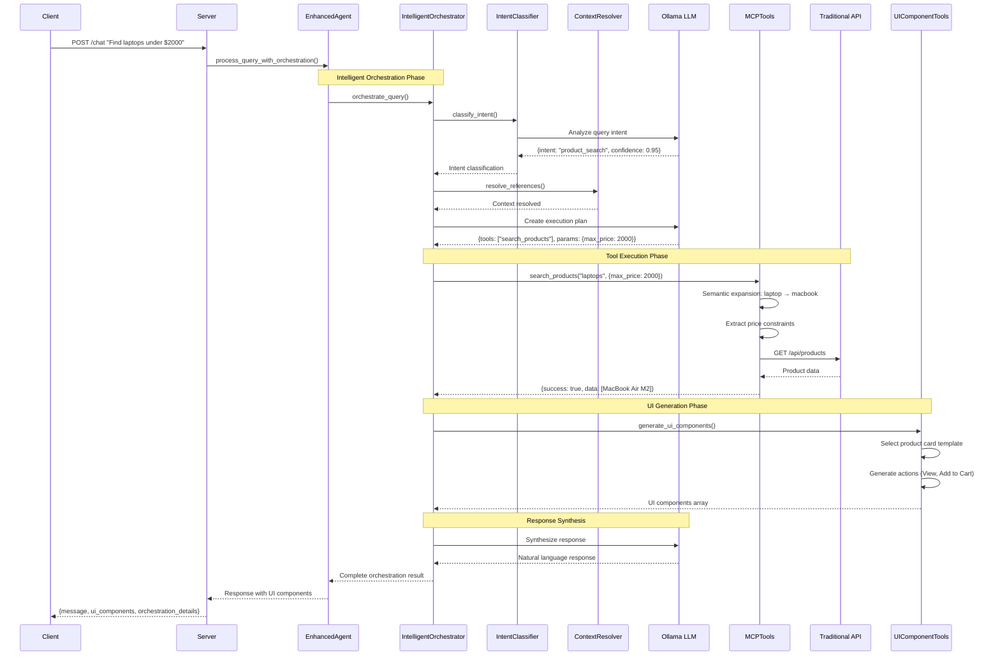

# Step 4: Dynamic UI System Architecture

## Component Diagram

```mermaid
graph TB
    %% External Systems
    subgraph "External Systems"
        Client[React Client<br/>Port: 5173]
        TradAPI[Traditional API<br/>Express + SQLite<br/>Port: 4000]
        Ollama[Ollama LLM<br/>Port: 11434]
        Qdrant[Qdrant Vector DB<br/>Port: 6333]
    end

    %% Main API Gateway
    subgraph "AI Backend Server [Port: 8001]"
        FastAPI[FastAPI Server<br/>server.py]
        
        subgraph "Request Router"
            ChatEndpoint["/chat endpoint"]
            HealthEndpoint["/health endpoint"]
            UIEndpoints["/ui/* endpoints"]
        end
    end

    %% Core Intelligence Layer
    subgraph "Intelligence Layer"
        subgraph "Orchestration Core"
            IntelligentOrch[IntelligentOrchestrator<br/>• LLM-driven tool selection<br/>• Multi-tool coordination<br/>• Response synthesis]
            IntentClass[IntentClassifier<br/>• Query understanding<br/>• Intent extraction<br/>• Confidence scoring]
            ContextRes[ContextResolver<br/>• Temporal references<br/>• Entity resolution<br/>• Session context]
        end

        EnhancedAgent[EnhancedAgent<br/>• Process orchestration<br/>• Fallback handling<br/>• Session management]
    end

    %% Tool Layer
    subgraph "MCP Tools Layer"
        MCPTools[MCPTools<br/>• Product search<br/>• Customer operations<br/>• Order management<br/>• Category browsing]
        
        subgraph "Smart Features"
            SemanticExp[Semantic Expansion<br/>laptop → macbook]
            PriceExtract[Price Extraction<br/>under $2000 → max_price]
        end
    end

    %% UI Generation Layer
    subgraph "Dynamic UI System"
        UICompTools[UIComponentTools<br/>• Component selection<br/>• Layout strategies<br/>• Action generation]
        
        subgraph "Component Registry"
            CompScanner[ComponentScanner<br/>• AST parsing<br/>• Prop extraction]
            CompCache[ComponentCache<br/>• Performance cache<br/>• Hot reload]
            CompWatcher[ComponentWatcher<br/>• File monitoring<br/>• Auto-invalidation]
        end

        subgraph "UI Patterns"
            ProductUI[Product Cards]
            OrderUI[Order Views]
            ComparisonUI[Comparison Tables]
        end
    end

    %% Knowledge Layer
    subgraph "RAG Service Layer"
        RAGService[RAGService<br/>• Query classification<br/>• Semantic search<br/>• Hybrid responses]
        
        subgraph "Knowledge Bases"
            FAQ[FAQ Knowledge]
            BizRules[Business Rules]
            Requirements[Requirements Docs]
            UIPatterns[UI Patterns]
        end
    end

    %% Data Flow - User Request
    Client -->|User Query| ChatEndpoint
    ChatEndpoint -->|1. Try Orchestration| EnhancedAgent
    
    %% Orchestration Flow
    EnhancedAgent -->|2. Orchestrate| IntelligentOrch
    IntelligentOrch -->|3. Classify Intent| IntentClass
    IntentClass -->|4. LLM Analysis| Ollama
    IntelligentOrch -->|5. Resolve Context| ContextRes
    
    %% Tool Execution
    IntelligentOrch -->|6. Execute Tools| MCPTools
    MCPTools -->|7. API Calls| TradAPI
    MCPTools --> SemanticExp
    MCPTools --> PriceExtract
    
    %% Knowledge Integration
    EnhancedAgent -->|Knowledge Query| RAGService
    RAGService -->|Vector Search| Qdrant
    RAGService --> FAQ
    RAGService --> BizRules
    
    %% UI Generation
    IntelligentOrch -->|8. Generate UI| UICompTools
    UICompTools --> CompScanner
    CompScanner --> CompCache
    CompCache --> CompWatcher
    UICompTools --> ProductUI
    UICompTools --> OrderUI
    UICompTools --> ComparisonUI
    
    %% Response Flow
    IntelligentOrch -->|9. Synthesize| Ollama
    EnhancedAgent -->|10. Response| ChatEndpoint
    ChatEndpoint -->|Final Response| Client

    %% Fallback Path
    EnhancedAgent -.->|Fallback if Orchestration Fails| RAGService
    
    %% Component Monitoring
    CompWatcher -->|File Changes| CompCache
    
    %% UI Component Endpoints
    Client -->|Component Requests| UIEndpoints
    UIEndpoints --> UICompTools

    %% Styling
    classDef external fill:#e1f5fe,stroke:#01579b,stroke-width:2px
    classDef intelligence fill:#f3e5f5,stroke:#4a148c,stroke-width:2px
    classDef tools fill:#fff3e0,stroke:#e65100,stroke-width:2px
    classDef ui fill:#e8f5e9,stroke:#1b5e20,stroke-width:2px
    classDef knowledge fill:#fce4ec,stroke:#880e4f,stroke-width:2px
    
    class Client,TradAPI,Ollama,Qdrant external
    class IntelligentOrch,IntentClass,ContextRes,EnhancedAgent intelligence
    class MCPTools,SemanticExp,PriceExtract tools
    class UICompTools,CompScanner,CompCache,CompWatcher,ProductUI,OrderUI,ComparisonUI ui
    class RAGService,FAQ,BizRules,Requirements,UIPatterns knowledge
```



## Data Flow Sequence



## Key Architectural Patterns

### 1. **Intelligent Orchestration Pattern**
```
User Query → LLM Planning → Tool Execution → Response Synthesis
```
- LLM decides which tools to call
- No hardcoded business logic
- Multi-tool coordination support

### 2. **Fallback Cascade Pattern**
```
Try Orchestration → Fallback to Intent Classification → Fallback to RAG → Fallback to Direct Search
```
- Graceful degradation
- Always returns a response
- Performance optimization

### 3. **Component Caching Pattern**
```
File System → AST Parser → Component Registry → Memory Cache → Hot Reload
```
- Efficient component discovery
- Real-time updates
- Performance optimization

### 4. **Context Resolution Pattern**
```
Session State → Temporal References → Entity Resolution → Execution Context
```
- Stateful conversations
- "Last order" resolution
- Customer context awareness

## Component Responsibilities

### **IntelligentOrchestrator**
- Plans tool execution strategy
- Coordinates multi-tool workflows
- Synthesizes results into responses

### **IntentClassifier**
- LLM-based query understanding
- Extracts entities and constraints
- Provides confidence scoring

### **ContextResolver**
- Resolves "last", "recent" references
- Maintains session context
- Handles customer identification

### **MCPTools**
- Interfaces with Traditional API
- Semantic query expansion
- Price constraint extraction

### **UIComponentTools**
- Selects appropriate UI components
- Generates component props
- Creates action handlers

### **RAGService**
- Knowledge base search
- FAQ and business rules
- Hybrid response generation

## Technology Stack

| Layer | Technology | Purpose |
|-------|------------|---------|
| API Gateway | FastAPI | Async request handling |
| LLM | Ollama (Gemma 3:12B) | Intelligence engine |
| Vector DB | Qdrant | Semantic search |
| Traditional API | Express + SQLite | Data persistence |
| Component Analysis | Python AST | React component parsing |
| Caching | In-memory + File | Performance optimization |
| File Watching | Watchdog | Hot reload support |

## Scalability Considerations

1. **Horizontal Scaling**
   - Stateless orchestration design
   - Session storage can be externalized
   - Multiple server instances supported

2. **Performance Optimization**
   - Component caching reduces AST parsing
   - Parallel tool execution capability
   - Smart fallback paths

3. **Extensibility**
   - New tools easily added to registry
   - LLM model swappable
   - UI patterns expandable

## Security & Isolation

- **API Gateway**: All requests through FastAPI
- **Tool Isolation**: MCP tools sandboxed
- **LLM Isolation**: Separate Ollama service
- **Data Validation**: Pydantic models throughout

---

This architecture represents a **paradigm shift** from traditional hardcoded business logic to an **intelligent, LLM-driven system** where business requirements drive behavior rather than code.